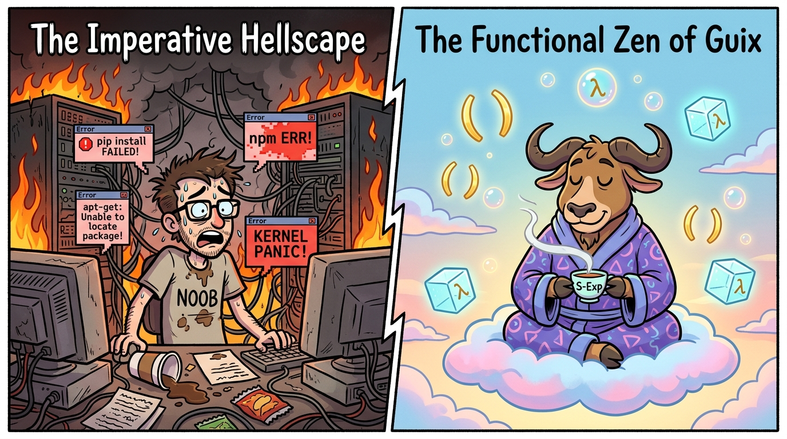

## Dedication

> *Dedicated to everyone who ever ran `sudo apt-get dist-upgrade` at 4:58 PM on a Friday and spent the entire weekend staring at a broken X server and crying into an unbootable kernel.*
>
> *To all the developers whose software "works on my machine" and immediately bursts into flames on anyone else's.*
>
> *And to the humble parenthesis `()`, without which this entire universe would dissolve into an unstructured chaos of arbitrary YAML indents.*

**Colophon**  
This book was typeset with LaTeX using `pdflatex`. The code examples were validated against GNU Guix on GNU/Linux. No global states, mutable `/usr/lib` symlinks, or Python virtualenvs were harmed in the making of this manuscript. All builds are bit-for-bit reproducible, give or take cosmic rays.


## Preface: The Imperative Hellscape and the Functional Cure

> *""Computers are fast because they do exactly what you tell them to do. Computers are broken because what you told them to do was insane.""*
> 
> — **Anonymous Systems Engineer**

Let us begin with a moment of silence for the countless hard drives, continuous integration servers, and weekend plans destroyed by the following phrase:

**`sudo apt-get upgrade -y`**

You know the feeling. You run the command innocently because you wanted a slightly newer version of a text editor. Suddenly, 412 packages are being downloaded. `libc6` is being replaced in-place while your running processes are actively executing its memory pages. A post-install script written by an overcaffeinated maintainer in 2008 runs an interactive dialog box in the background, locks the DPKG database, and when your machine reboots, your graphical interface has been replaced by a blinking cursor and an existential dread.

Welcome to the **Imperative Hellscape**.

<div align="center">
  
  <br/>
  <em>Figure 0.1: The choice is yours: constant panic in the imperative flames, or peaceful functional enlightenment with GNU Guix.</em>
</div>

### The Root of All Sysadmin Evil: Mutable State

For fifty years, the Unix philosophy built miraculous tools on a foundation of sand: the **Filesystem Hierarchy Standard (FHS)**. In FHS, there is exactly one place where shared libraries go: `/usr/lib`. There is one place where binary executables go: `/usr/bin`.

Think of `/usr/bin` as a communal refrigerator in a student dorm shared by thirty messy roommates:

  - Alice puts her carton of milk (Python 3.9) in the fridge.
  - Bob comes along, decides he needs oat milk (Python 3.11), throws Alice's milk in the dumpster, and puts his oat milk in the exact same spot.
  - Carol tries to make coffee with Alice's milk, discovers an oat-flavored disaster, and the entire kitchen explodes with `ImportError: symbol not found`.

Every time you run `apt`, `dnf`, `pacman`, or `brew`, you are mutating a single global state. When two programs need different versions of the same shared library, traditional systems resort to terrifying hacks:

  - **Virtual environments** (e.g., Python `venv`, Node `node_modules`): Dumping 80,000 duplicated tiny files in every single directory on your hard drive until your SSD groans in agony.
  - **Docker containers**: Shipping an entire 2-gigabyte Debian operating system just to run a 10-line Python script because you gave up on resolving dependencies cleanly.
  - **Flatpak / Snap**: Bundling runtime runtimes inside bundles inside sandbox layers.

> [!CAUTION]
> **😭 Tears of the Imperative Developer: The Packaging Band-Aid Pyramid**
>
> First, we had `tar.gz`. Then we had `dpkg` and `rpm` to track what was overwritten. When dependencies tangled into knots, we created `apt` and `yum` to untangle the knots. When global dependencies broke, we invented Python virtualenvs, Ruby rbenv, and Node nvm. When those still leaked system libraries, we shoved everything into 1.5GB Docker images. When Docker images drifted over time, we invented Kubernetes to orchestrate the chaos.
>
> At no point did anyone pause and ask: *"What if we stopped overwriting files in `/usr/lib` like cavemen?"*

### The Functional Epiphany

In 2006, a Dutch computer scientist named Eelco Dolstra published a doctoral dissertation introducing **purely functional package management**. The core thesis is mind-bendingly simple:

$\text{Package} = f(\text{Source Code}, \text{Compiler}, \text{Dependencies}, \text{Build Flags})$

In pure mathematics, $2 + 2$ is always $4$. If you call $f(x)$, you get the same result every time, without setting fire to the chalkboard. Why should compiling software be any different?

If a package is a pure mathematical function of its inputs, then:

  - Every package build can live in an immutable, read-only directory named after the cryptographic hash of all its inputs:
  
  `/gnu/store/8h3j2n9k4...-python-3.10.7`
  
  - Multiple versions of Python, OpenSSL, or GCC can coexist simultaneously without knowing or caring about each other.
  - Upgrading a package is simply moving a symlink. If you don't like the upgrade, moving the symlink back is an instantaneous, zero-risk **rollback**.

### Why GNU Guix? (And Why Scheme?)

While Nix pioneered functional package management, it invented its own idiosyncratic, domain-specific configuration language.

**GNU Guix** took this functional paradigm and made a radical, glorious choice: **Everything is GNU Guile Scheme.**

> [!IMPORTANT]
> **✨ Functional Alchemy & Arcana: The Power of Scheme**
>
> In Guix, your package definitions are Scheme. Your system configuration is Scheme. Your init system (GNU Shepherd) is Scheme. Your build phases are Scheme. Your dotfiles are Scheme.
>
> There is no boundary between "configuration data" and "real code". You have the full power of a battle-tested, general-purpose, Lisp-dialect programming language with macros, first-class functions, and interactive REPL debugging at every layer of the operating system stack.

Yes, there will be parentheses. Many parentheses. But do not be afraid! As you read through this book, you will discover that those parentheses are not visual noise; they are the armor that protects your operating system from corruption.

### How This Book Is Structured

  - **Part I: The Grand Illusion (Package Management)**: We explore the immutable store (`/gnu/store`), unprivileged package management on foreign Linux distributions, transactional profiles and rollbacks, channels, and time travel with `guix time-machine`.
  - **Part II: The Development Wonderland**: We ditch Docker and virtualenvs for `guix shell`, explore isolated containers, write `manifest.scm` files, and integrate with `direnv`.
  - **Part III: The Operating System (Guix System & Guix Home)**: We build declarative, fully reproducible operating systems using a single `config.scm`, explore the Scheme-powered Shepherd init system, and manage our personal dotfiles with `guix home`.
  - **Part IV: The Master Craftsman (Packaging with Guix)**: We learn how to write our own package recipes, master build systems, tame build phases, write G-Expressions (`#\~{}`), and publish our own custom channels.
  - **Part V: The Real-World Frontier (Domains & Nonguix)**: We examine Guix's real-world impact across High-Performance Computing (HPC), bioinformatics, machine learning, and show how Nonguix tames modern laptops, Wi-Fi chips, and NVIDIA GPUs.
  - **Appendices**: The ultimate cheat sheet and troubleshooting guide for escaping any bind.

Buckle your seatbelt, fire up your terminal, and let us venture into the serene, reproducible promised land of GNU Guix.


## Chapter 1: The Curse of FHS and the Salvation of the Store

> *""Inside every large operating system is an FHS structure struggling to corrupt itself.""*
> 
> — **The Tao of Declarative Systems**

To understand why GNU Guix exists, we must first confront the original sin of modern Unix systems: the **Filesystem Hierarchy Standard (FHS)**. 

If you open up an ordinary Linux system (Ubuntu, Fedora, Arch, or Debian), you will see directories named `/bin`, `/sbin`, `/usr/bin`, `/lib`, and `/usr/lib`. These directories are what computer scientists technically refer to as *"a giant mutable pile of shared state that everyone writes to and hopes nobody touches."*

### The Myth of the Shared Library

In the 1970s and 1980s, computer storage was measured in kilobytes. A hard drive holding 10 megabytes was the size of a washing machine and cost more than a family sedan. In that era, sharing dynamic libraries (`.so` files) in a global directory like `/usr/lib` was an absolute necessity.

Today, your smartphone has 256 gigabytes of solid-state storage, but your server still crashes because Package A upgraded `libssl.so.1.1` to `libssl.so.3.0`, instantly breaking Package B, which was compiled against the older ABI.

> [!CAUTION]
> **😭 Tears of the Imperative Developer: The Dependency Diamond of Doom**
>
> Consider three software packages:
> 
>   - Your critical application needs **Library X** (version 1.0) and **Library Y** (version 2.0).
>   - **Library X** requires **LibZ** (version 1.4).
>   - **Library Y** requires **LibZ** (version 2.1).
> 
> In an FHS system, `/usr/lib/libz.so` can only point to one file. You are now trapped in dependency hell. Your package manager will either refuse to install the software, or it will overwrite `libz.so` and silently turn your application into a source of random segmentation faults.

### The Holy Store: /gnu/store

GNU Guix throws the FHS model straight out the window. In Guix, there is no global `/usr/bin` or `/usr/lib`. Instead, every piece of software, every library, every configuration file, and every script lives in an isolated, read-only sanctuary called the **Store**:

`/gnu/store/`

Every directory inside `/gnu/store` has a very specific, deterministic naming convention:

`/gnu/store/`**7yv4938r4wbz9p42x...**-**coreutils-9.1**

What is that 32-character gibberish at the front? That is a **base32 cryptographic hash** of all the inputs used to build that exact package.

> [!IMPORTANT]
> **✨ Functional Alchemy & Arcana: What Goes into the Hash?**
>
> The cryptographic hash prefix is NOT simply the hash of the source code archive! It is computed from the complete graph of dependencies:
> 
>   - The source code tarball / git commit and its checksum.
>   - The build scripts, flags, and patches.
>   - The exact compiler binary (e.g., GCC 11.3.0) and its own dependency hash.
>   - The exact C library (`glibc`) used during linking.
>   - All transitive libraries and build-time tools.
> 
> If even a single compiler flag or dependency changes by one bit, the hash changes completely, resulting in a completely distinct directory in `/gnu/store`.

Because of this, you can have 14 different versions of Python, 5 versions of GCC, and 3 different builds of OpenSSL coexisting peacefully in `/gnu/store`. They never collide. They never overwrite each other.

<div align="center">
  
  <br/>
  <em>Figure 1.1: A Tale of Two Stores: The chaotic communal dorm fridge of `/usr/bin` versus the immutable crystal vault of `/gnu/store`.</em>
</div>

### Derivations: The Recipe Behind the Magic

Before Guix builds anything, it generates a low-level recipe called a **Derivation** (stored as a `.drv` file in `/gnu/store`). 

A derivation is a completely serializable, language-agnostic description of an action to perform. You can think of it as an immutable build plan that specifies:

  - The inputs required (other store paths).
  - The build environment (environment variables, architecture).
  - The builder executable to invoke (often Guile or a shell script).
  - The expected output paths in `/gnu/store`.

When you ask Guix to install or build a package, Guile evaluates your high-level Scheme code, translates it into a derivation graph (a Directed Acyclic Graph, or DAG), and hands it over to the background build daemon (`guix-daemon`).

### The Isolated Build Sandbox

How does Guix guarantee that a build doesn't secretly depend on some random file sitting in `/tmp` or a global header file?

When the `guix-daemon` executes a derivation, it puts the build process inside an ultra-strict, isolated **chroot sandbox**:

  - **No Network Access**: The builder has no internet connectivity during the build phase (unless it is a dedicated fixed-output download derivation with a verified cryptographic hash).
  - **Clean Environment**: All host environment variables are stripped away. Only variables explicitly declared in the derivation exist.
  - **Hermetic Filesystem**: The only files visible to the build process are the explicitly declared input store paths and an empty temporary build directory.
  - **Time Travel to 1970**: The file timestamps inside the build directory are normalized to January 1, 1970, 00:00:01 UTC. This prevents build tools (like `zip` or `tar`) from baking non-deterministic timestamps into their binaries!

> [!WARNING]
> **⚠️ Caution: Footgun Detected!: The Impure Build Assumption**
>
> If you are used to building software on Ubuntu where your `Makefile` secretly relies on `/usr/include/some-header.h` that you installed five years ago and forgot about, Guix will immediately slap your hand and fail the build. In Guix, if an input is not explicitly declared in Scheme, it does not exist in the universe.

### Profiles and Generations: The Symlink Forest

If everything is buried inside an unreadable hash path like:

`/gnu/store/7yv4938r4wbz9p42x...-coreutils-9.1/bin/ls`

how on earth does a normal user run `ls` from their command line?

Guix solves this through **Profiles** and **Generations**.

  - A **Profile** is simply a directory containing symlinks pointing into various store paths. It mimics a standard Unix hierarchy (`bin/`, `lib/`, `share/`).
  - Your shell's `$PATH` simply points to `~/.guix-profile/bin`.
  - Whenever you install or remove software, Guix builds a new store item representing the merged union of all your installed packages. This new union becomes **Generation $N+1$**.
  - Guix updates the symlink `~/.guix-profile` to point to Generation $N+1$ using an **atomic rename** system call.

| **Symlink Pointer** |  | **Target Destination** |
| :--- | :--- | :--- |
| `~/.guix-profile` | → | `/var/guix/profiles/per-user/alice/guix-profile` |
| `guix-profile` | → | `guix-profile-42-link` |
| `guix-profile-42-link` | → | `/gnu/store/...-profile/bin/ls` |
| `guix-profile-41-link` | → | `/gnu/store/...-profile/bin/ls` (Rollback target) |

Because switching generations is literally just changing a single symbolic link, **installing packages is instantaneous and atomic**. If your laptop battery dies in the middle of a 4-gigabyte installation, your running profile is completely untouched. You cannot get a corrupted, half-installed system.

And if you hate the new version? You simply flip the symlink back to the previous generation.

### Two Operating Modes: Foreign Distros and Guix System

Before we jump into the command line, one foundational distinction must be highlighted. GNU Guix can be operated in two fundamentally different modes:

  - **As a Package Manager on a "Foreign" Distribution**: You install Guix on top of an existing, traditional Linux distribution such as Debian, Ubuntu, Fedora, openSUSE, or Arch Linux. In this setup, Guix coexists harmoniously alongside your host system's native package manager (`apt`, `dnf`, `pacman`). The host OS continues to handle your kernel, hardware drivers, and system daemons, while Guix provides an unprivileged, isolated `/gnu/store` and per-user profiles. You get reproducible packages, atomic rollbacks, and multi-version library coexistence without altering the underlying OS.
  - **As a Complete Operating System (Guix System)**: Guix can also replace your entire traditional distribution. In Guix System, everything—from the Linux kernel, bootloader, Shepherd init system, and background daemons to user accounts and desktop environments—is declared within a unified Scheme configuration file (`/etc/config.scm`).

Throughout Part~I and Part~II of this book, we will primarily explore Guix through the lens of a package manager running on a foreign distribution. As you will see in [Chapter 2](#chapter-2-daily-life-with-the-guix-cli), the familiar, non-declarative commands for installing software (`guix install`) are uniquely suited to foreign distributions—whereas on Guix System, declarative configuration takes center stage.


## Chapter 2: Daily Life with the Guix CLI

> *""There are two types of sysadmins: those who have broken production with an update, and those who are about to.""*
> 
> — **Murphy's Law of Operations**

Now that you understand that `/gnu/store` is a cryptographic citadel of immutable purity, let us roll up our sleeves and interact with the Guix command-line interface.

Unlike traditional package managers that demand `sudo` permissions to modify the global system state, Guix package management is entirely **unprivileged**. Every user on the system can install, upgrade, and remove software in their own user profile without ever asking the sysadmin for permission.

### The Non-Declarative CLI: A Foreign Distro Lifeline

Before typing our first installation command, we must address an essential philosophical question: *How does the Guix command-line interface fit into the functional, declarative vision of GNU Guix?*

The commands introduced in this chapter—`guix install`, `guix remove`, and `guix upgrade`—represent the **imperative**, or **non-declarative**, style of package management. In an imperative model, you type sequential commands to mutate your active user profile step by step over time.

It is crucial to understand that **this non-declarative way of installing packages mainly applies when Guix is used as an auxiliary package manager on a distribution other than Guix System** (what the Guix community terms a **foreign distribution**, such as Debian, Ubuntu, Fedora, openSUSE, or Arch Linux).

#### Why the Non-Declarative Model Thrives on Foreign Distros

When you install GNU Guix on top of Ubuntu or Debian, you do not control the base operating system with Guix; your host kernel, systemd init system, display manager, and base utilities are all governed by the host distribution. In this environment, your goals are practical and immediate:

  - You want cutting-edge software or specific development tools without waiting for your host distribution's slow release cycle.
  - You lack `sudo` or root privileges on a shared university cluster or corporate workstation.
  - You need to run conflicting libraries side-by-side without contaminating the host system's `/usr/lib`.

In this foreign distribution setting, running `guix install` is wonderfully liberating. It acts as a direct, unprivileged replacement for traditional package managers like `apt` or `brew`, yet bestows the mathematical superpowers of the Store: atomic transactions, zero dependency conflicts, and instantaneous rollbacks.

#### Why Guix System Purists Avoid `guix install`

Conversely, if you are running **Guix System**—where Guix is the standalone operating system—this non-declarative approach is largely considered an **anti-pattern** and is discouraged for permanent workstation setups.

Why? Because Guix System is built on the core tenet that **the file is the machine**:

  - System packages belong in the `packages` field of your declarative `/etc/config.scm` ([Chapter 6](#chapter-6-guix-system-one-file-to-rule-them-all)).
  - User tools and dotfiles belong in a declarative home environment managed by **Guix Home** ([Chapter 8](#chapter-8-guix-home-declarative-dotfiles-and-userland)) or project-specific manifests ([Chapter 5](#chapter-5-project-manifests-and-package-transformations)).
  - Temporary, disposable tools are best invoked on-demand using ephemeral `guix shell` environments ([Chapter 4](#chapter-4-goodbye-virtualenvs-hello-guix-shell)).

If you run `guix install` on Guix System, you create an unversioned, mutable profile under `~/.guix-profile`. If your hard drive fails or you replicate your environment on another computer, those imperatively installed packages will be completely absent because they were never committed to your declarative Scheme configuration!

> [!IMPORTANT]
> **✨ Functional Alchemy & Arcana: Non-Declarative CLI vs. Declarative Configuration**
>
> 
>   - **Non-Declarative (`guix install`, `guix remove`)**:
>   Best suited for foreign distros (Debian, Ubuntu, Fedora) and fast ad-hoc experimentation. State is tracked via profile generations in `/var/guix/profiles`, but cannot be fully reproduced on another machine without replaying your shell history.
>   - **Declarative (`config.scm`, Guix Home, Manifests)**:
>   The standard way on Guix System. State is declared in Scheme files tracked with Git. You reconfigure your system with `guix system reconfigure` or your user environment with `guix home reconfigure`. Any machine can be cloned with 100% mathematical precision.
> 

Why, then, do we begin our journey with the non-declarative CLI? Because it is the gentlest and most intuitive bridge from traditional package managers. It allows you to grasp profiles, generations, rollbacks, and garbage collection hands-on before we ascend to the declarative peaks of manifests and Guix System.

### Installing and Removing Packages

The most basic operations will look pleasantly familiar, with a subtle functional twist:
```bash
# Search for software (searches names, synopses, and descriptions)
guix search emacs

# Show detailed information about a package
guix show emacs-ripgrep

# Install a package into your active user profile
guix install htop git ripgrep

# Remove a package from your user profile
guix remove htop

# Upgrade all packages in your profile to their latest versions
guix upgrade
```

> [!WARNING]
> **⚠️ Caution: Footgun Detected!: The Imperative Trap on Guix System**
>
> If you are reading this while running Guix System, resist the urge to turn `guix install` into your daily routine! Imperatively installed packages live in an isolated profile outside your system's declarative `config.scm`. Treat the commands in this chapter as mastering the transactional mechanics of profiles and rollbacks, but save your permanent workstation setup for the declarative configurations in Part~II and Part~III.

> [!TIP]
> **💡 Guix Wizard Pro-Tip: Fast Searching with Recutils**
>
> When you run `guix search`, Guix evaluates the Scheme package records and outputs results formatted as `recutils` records. You can pipe the output into standard tools or filter fields:

> ```bash
> guix search emacs | grep -E '^name:'
> ```
>
> Or search strictly by package name without scanning full descriptions:

> ```bash
> guix search '^emacs$'
> ```
>

### The Miraculous Undo Button: Rollbacks

Suppose you ran `guix upgrade` on a Monday morning. The new version of your favorite software contains a catastrophic regression, or perhaps you accidentally uninstalled your text editor right before a deadline.

On an imperative distribution (Ubuntu, Arch, etc.), you would now be combing through cache archives, manually downloading `.deb` or `.pkg.tar.zst` files, and praying you don't trigger dynamic linker errors.

On Guix, you simply invoke the undo button:
```bash
# Instant rollback to the previous generation
guix package --roll-back
```

> [!CAUTION]
> **😭 Tears of the Imperative Developer: The 2-Millisecond Rescue**
>
> When you type `guix package –roll-back`, Guix does not download anything. It does not recompile anything. It merely updates the `~/.guix-profile` symlink to point back to Generation $N-1$. The entire rollback takes approximately 2 milliseconds. You can do it while running a live presentation and nobody in the audience will notice.

### Inspecting and Navigating Generations

Every transactional change to your profile creates a permanent historical record called a **Generation**. You can inspect the entire history of your user environment:
```bash
guix package --list-generations
```

This displays an informative timeline:
```bash
Generation 1    Oct 12 2025 14:02:11
 + git          2.41.0          out     /gnu/store/7a3...-git-2.41.0
 + ripgrep      13.0.0          out     /gnu/store/8bc...-ripgrep-13.0.0

Generation 2    Oct 14 2025 09:15:30
 + python       3.10.7          out     /gnu/store/9df...-python-3.10.7

Generation 3 (current)  Oct 15 2025 11:22:04
 - ripgrep      13.0.0          out     /gnu/store/8bc...-ripgrep-13.0.0
 + ripgrep      14.0.1          out     /gnu/store/2ea...-ripgrep-14.0.1
```

You can switch to any arbitrary point in your history at will:
```bash
# Travel directly to Generation 1
guix package --switch-generation=1
```

### Multiple Custom Profiles

Why cram your video editor, your Haskell compiler, your audio synthesizer, and your scientific Python stack into a single bloated user profile?

In Guix, you can instantiate as many independent profiles as you want by passing the `-p` or `–profile` flag:
```bash
# Create a dedicated profile for audio production
guix package -p ~/profiles/audio -i ardour jack2 audacity

# Create a dedicated profile for data science
guix package -p ~/profiles/datascience -i python python-numpy python-scipy

# Activate a custom profile in your current shell
source ~/profiles/audio/etc/profile
```

When you source `etc/profile`, Guix automatically configures your environment variables (`PATH`, `LIBRARY_PATH`, `GUIX_PYTHONPATH`, etc.) for that specific set of packages.

> [!TIP]
> **💡 Guix Wizard Pro-Tip: Declarative Profiles with Manifests**
>
> While we create custom profiles imperatively in this chapter using `-i`, Guix also lets you instantiate and update profiles **declaratively** from a Scheme manifest file:

> ```bash
> guix package -p ~/profiles/datascience -m manifest.scm
> ```
>
> This combines the isolation of separate profiles with the reproducibility of source-controlled configuration, which we explore in [Chapter 5](#chapter-5-project-manifests-and-package-transformations).

### Garbage Collection and Disk Space Management

Because Guix keeps old generations around to make rollbacks instantaneous, your `/gnu/store` will eventually grow larger as you install and upgrade software over months.

> [!IMPORTANT]
> **✨ Functional Alchemy & Arcana: How Garbage Collection Works**
>
> Guix uses a tracing garbage collector, similar to programming language runtimes (like Java, Go, or Guile).
> 
>   - **GC Roots**: Guix scans known roots (active user profiles, system generations, running processes, and pins in `/var/guix/gcroots`).
>   - **Liveness Trace**: Any store item that can be reached via symlinks or references from an active root is marked as **live**.
>   - **Reclamation**: Any store item that is completely unreferenced is deleted from disk.
> 

If you simply run `guix gc`, it will only remove packages that are not referenced by **any** generation of any profile. To reclaim significant space, you first delete historical generations you no longer need:
```bash
# Delete all profile generations older than 30 days
guix package --delete-generations=30d

# Delete all generations except the current one
guix package --delete-generations

# Run the garbage collector to reclaim unused disk space
guix gc

# Free disk space down to a target size (e.g., free at least 10GB)
guix gc -F 10G
```

> [!WARNING]
> **⚠️ Caution: Footgun Detected!: The Premature GC Trap**
>
> If you delete your old generations with `guix package –delete-generations` and then immediately run `guix gc`, your previous generations are gone forever. You will no longer be able to roll back to yesterday's profile! Keep at least a few days of generations around unless you are in desperate need of disk space.

### Substitutes: Why You Do Not Have to Compile Everything

A common fear among newcomers is: *"If Guix is functional and source-based, am I going to spend the next four days compiling Firefox and Chromium from source?"*

The answer is **no**. Guix uses **Substitutes** (pre-built binary caches signed by trusted continuous integration servers like `ci.guix.gnu.org` and `bordeaux.guix.gnu.org`).

When Guix determines that a derivation hash `/gnu/store/abc123...-firefox-115.0.drv` is needed, it checks if a trusted substitute server already built that exact derivation. If it exists, Guix simply downloads the pre-built cryptographic narball (normalized archive) and unpacks it into your store. You get all the speed of a binary package manager with all the mathematical purity of a source-based functional system.

### The Road Ahead: Beyond Non-Declarative Mutations

The non-declarative CLI commands covered in this chapter provide an immediate, dependable upgrade for anyone running Guix on a foreign distribution. You can install, upgrade, and rollback software without root privileges and without fear of library collision.

Yet, imperative management has a fundamental ceiling: your environment remains an artifact of whatever sequence of commands you typed into your terminal over the past six months. In the upcoming chapters, we will transcend imperative mutations:

  - In [Chapter 3](#chapter-3-channels-pins-and-time-travel), we pin the package tree to precise Git revisions and travel through time.
  - In [Chapter 4](#chapter-4-goodbye-virtualenvs-hello-guix-shell) and [Chapter 5](#chapter-5-project-manifests-and-package-transformations), we replace permanent profile installations with ephemeral shells and version-controlled manifests.
  - In [Chapter 6](#chapter-6-guix-system-one-file-to-rule-them-all) and [Chapter 8](#chapter-8-guix-home-declarative-dotfiles-and-userland), we achieve full declarative mastery over entire operating systems and user homes.


## Chapter 3: Channels, Pins, and Time Travel

> *""Those who cannot remember their dependencies are condemned to repeat their compilation errors.""*
> 
> — **George Santayana (adapted for sysadmins)**

By default, GNU Guix provides thousands of packages in its official repository. But what if you need packages that are not in the main tree, proprietary drivers for your laptop's Wi-Fi card, cutting-edge bioinformatics pipelines, or your company's proprietary microservices?

Welcome to the world of **Channels**.

### What Is a Channel?

In Guix, a **Channel** is not an opaque binary PPA or an unverified APT repository. 

A channel is simply a **Git repository** containing Scheme source files that define packages and services. When you run `guix pull`, Guix clones each channel repository, verifies its cryptographic commit signatures, compiles the Scheme modules, and builds a brand-new `guix` executable and package database.

### Configuring Channels: `~/.config/guix/channels.scm`

You configure your active channels by creating a Scheme file at `~/.config/guix/channels.scm`.

Let us examine a typical multi-channel configuration:
```scheme
;; ~/.config/guix/channels.scm
(list
  ;; 1. The official GNU Guix channel (always required)
  (channel
    (name 'guix)
    (url "https://git.savannah.gnu.org/git/guix.git")
    (branch "master")
    ;; Cryptographic introduction for commit authentication
    (introduction
      (make-channel-introduction
        "9edb3f66fd807b096b48283debd4ddcc33ab9a99"
        (openpgp-fingerprint
          "BBB0 2DDF 2CEA F6A8 0D1D  E643 A2A0 6DF2 A33A 54FA"))))

  ;; 2. Nonguix: Non-free drivers, firmware, and proprietary software
  (channel
    (name 'nonguix)
    (url "https://gitlab.com/nonguix/nonguix")
    (branch "master")
    (introduction
      (make-channel-introduction
        "2a97b46e96194b703221a074ddb4402d5dd99708"
        (openpgp-fingerprint
          "2A39 3FFF 68F4 EF7A 3D29  12AF 6F51 20A0 22FB B2D5"))))

  ;; 3. Guix Science: Scientific software and HPC packages
  (channel
    (name 'guix-science)
    (url "https://codeberg.org/guix-science/guix-science.git")
    (branch "master")
    (introduction
      (make-channel-introduction
        "b3a5e796aa404a60773b06cf317b3e51240366eb"
        (openpgp-fingerprint
          "CA4D 7EB7 5D15 73A8 E426  3850 5F12 30A0 CFFB 97BE")))))
```

### Notable Custom Channels

The Guix ecosystem features several essential community channels that expand your package universe:

  - **Nonguix**: Provides packages that cannot be included in upstream GNU Guix due to the GNU Free System Distribution Guidelines (FSDG). This includes the vanilla Linux kernel (`linux`), proprietary Wi-Fi firmware (`linux-firmware`), Steam, Spotify, Google Chrome, and NVIDIA drivers.
  - **Guix Science**: High-Performance Computing (HPC), bioinformatics, computational biology, machine learning (PyTorch, JAX), and computer vision pipelines maintained by academic research institutes worldwide.
  - **Guix Past**: A historical channel containing legacy toolchains, GCC 2.95, Python 2.4, and ancient libraries needed to reproduce scientific papers published 15 years ago.

> [!IMPORTANT]
> **✨ Functional Alchemy & Arcana: Channel Authentication with OpenPGP**
>
> Notice the `introduction` block in each channel definition! Guix uses cryptographic OpenPGP signatures on every single Git commit in a channel. 
> If an attacker compromises GitHub or GitLab and pushes a malicious commit without a valid signature from an authorized developer key, `guix pull` will abort with a security failure before executing any code.

### Authorizing Pre-Built Substitutes for Channels

When using external channels like Nonguix or Guix Science, you don't have to compile large software packages (like the Linux kernel or PyTorch) locally from scratch. Each channel maintains dedicated build farms that serve pre-built binaries (substitutes).

To authorize these substitute servers, add their signing keys and URLs to your system configuration:
```bash
# Download and authorize the Nonguix signing key
wget https://substitutes.nonguix.org/signing-key.pub
sudo guix archive --authorize < signing-key.pub

# Update your Guix daemon with the substitute URL
sudo herd set-substitute-urls guix-daemon \
  https://substitutes.nonguix.org \
  https://bordeaux.guix.gnu.org \
  https://ci.guix.gnu.org
```

### Channel Pins: Locking Reality

How do you guarantee that a colleague running `guix pull` gets the exact same package versions you have today?

You **pin** your channels to specific Git commit hashes:
```scheme
;; Pinned channels.scm for guaranteed reproducibility
(list
  (channel
    (name 'guix)
    (url "https://git.savannah.gnu.org/git/guix.git")
    (commit "a84ef2b9d3e817921a415a77c3e53381a1795c64"))
  (channel
    (name 'nonguix)
    (url "https://gitlab.com/nonguix/nonguix")
    (commit "92e104c8f01bcf5594b2efc8f74f1b8a5b23d9b0")))
```

You can generate this pinned configuration automatically from your current system state with:
```bash
guix describe -f channels > channels.scm
```

This produces an exact, machine-readable Scheme file representing the precise Git commit hashes of all active channels (`guix`, `nonguix`, `guix-science`).

If you commit that output to a file named `channels.scm`, anyone can reproduce your multi-channel universe down to the exact bit using `guix time-machine`.

### The Superpower: `guix time-machine`

Now comes the coup de gr\^ace that makes every other package manager look like an antique.

Suppose you have a `channels.scm` file containing pins for GNU Guix and Guix Science from three years ago. You want to re-run an experiment today:
```bash
# Run an ad-hoc shell using the exact multi-channel universe from channels.scm
guix time-machine -C channels.scm -- shell python-pytorch r-ggplot2 -- python3 pipeline.py

# Or travel to a specific historic commit on the fly!
guix time-machine --commit=a84ef2b9d3... -- install emacs
```

<div align="center">
  
  <br/>
  <em>Figure 3.1: Traveling through the cosmic timeline: `guix time-machine` seamlessly executing 10-year-old scientific code with zero dependency drift.</em>
</div>

> [!CAUTION]
> **😭 Tears of the Imperative Developer: Scientific Reproducibility: A Solved Problem**
>
> In 2016, a survey in *Nature* revealed that over 70% of researchers had failed to reproduce another scientist's computational experiments due to dependency drift.
>
> With `guix time-machine` and multi-channel pins, scientific pipelines can be re-executed 10 years later producing identical numerical results.


## Chapter 4: Goodbye Virtualenvs, Hello `guix shell`

> *""Docker: Because why solve dependency hell cleanly when you can just ship an entire Debian virtual machine for a 50-line Node.js script?""*
> 
> — **Modern DevOps proverb**

Every software developer has experienced the nightmare of setting up a new development project:

  - You clone the repository.
  - The `README.md` tells you to install GCC 12, CMake 3.25, Python 3.10, PostgreSQL 14 client headers, and a very specific version of Rust.
  - Your host operating system has GCC 14, Python 3.12, and CMake 3.20.
  - You spend the next five hours fighting PPA repositories, Homebrew taps, and Docker permission issues.

GNU Guix introduces the ultimate developer superpower: `guix shell`.

### The Concept: Disposable, Ephemeral Environments

`guix shell` allows you to spawn a subshell containing any set of packages on demand, without polluting your user profile, without root permissions, and without touching your system's global files.

When you exit the subshell, the environment evaporates into thin air.
```bash
# Spawn a shell with Python, Numpy, and GCC ready to go
guix shell python python-numpy gcc-toolchain

# Inside the shell, everything is configured:
[env]$ python3 -c "import numpy as np; print(np.__version__)"
1.23.2
[env]$ gcc --version
gcc (GCC) 11.3.0

# Exit the shell, and your host environment is completely untouched
[env]$ exit
$ which python3
/usr/bin/which: no python3 in ($PATH)
```

You can also run one-off commands directly without even dropping into an interactive prompt:
```bash
# Run a one-liner inside a disposable Node.js environment
guix shell node -- node -e "console.log('Hello from Guix!')"
```

### Achieving True Isolation: `–pure`

By default, `guix shell` merges the specified packages with your host environment variables (like your existing `$PATH`). This is convenient for daily use, but what if you want to be 100% sure your code doesn't accidentally depend on some random binary hidden in `/usr/local/bin`?

You add the `–pure` flag:
```bash
guix shell --pure python python-requests -- python3 app.py
```

When `–pure` is specified, Guix clears almost all host environment variables. Only the packages explicitly declared on the command line exist in `$PATH`.

### Containers Without Docker: The `-C` Flag

Now for the real magic. Guix contains a built-in container engine based on unprivileged Linux kernel namespaces (mount, PID, network, IPC, and UTS namespaces).

By passing the `-C` (or `–container`) flag, Guix creates a lightweight, isolated Linux container on the fly:
```bash
guix shell --container python bash coreutils
```

Inside this container:

  - The filesystem contains **only** `/gnu/store` and an empty `/tmp`.
  - Your real `/home` directory is completely invisible.
  - The process cannot see or kill any processes running on the host system.
  - Network access is disabled by default!
  - You did **NOT** need `sudo`, a root daemon, or a Docker service running in the background.

> [!CAUTION]
> **😭 Tears of the Imperative Developer: Docker Daemon vs Guix Container**
>
> Docker requires a root-privileged daemon listening on a Unix socket, custom overlay filesystems, non-reproducible `Dockerfile` scripts that run `curl ... | bash`, and layers upon layers of cached bloat.
>
> `guix shell -C` uses native Linux kernel namespaces directly, boots in 50 milliseconds, shares the immutable `/gnu/store` directly with zero copy-on-write overhead, and is completely unprivileged.

<div align="center">
  
  <br/>
  <em>Figure 4.1: Containerization contrast: 50 tons of root-privileged Docker overhead crushing a 3-line script versus the weightless, unprivileged bubble of `guix shell –container`.</em>
</div>

### Fine-Grained Sharing: Filesystems and Network

What if your containerized application needs access to a local dataset or needs to make HTTP requests? Guix provides granular flags:
```bash
guix shell --container \
  --network \
  --expose=/data/images=/mnt/images:ro \
  --share=/home/user/workspace=/app \
  python python-torch \
  -- python3 /app/train.py
```

Let us break down these flags:

  - `–network` (or `-N`): Grants network namespace access (enables outbound/inbound internet).
  - `–expose=HOST=GUEST:ro`: Mounts a host directory inside the container as **read-only**.
  - `–share=HOST=GUEST`: Mounts a host directory inside the container with **read-write** permissions.

### The Instant Development Environment: `-D`

Suppose you want to contribute to an existing open-source package packaged in Guix, such as `inkscape`, `curl`, or `qemu`. 

How do you get all of its 50+ build dependencies, header files, libraries, and compilers set up on your machine?
```bash
# Enter a shell with all build dependencies of Inkscape installed!
guix shell -D inkscape
```

The `-D` (or `–development`) flag inspects the Guix package recipe for `inkscape`, gathers all of its `inputs`, `native-inputs`, and `propagated-inputs`, and drops you into a shell where every single build dependency is available. You can immediately run `cmake` and `make` without installing a single package globally!

> [!TIP]
> **💡 Guix Wizard Pro-Tip: The Development Flag on Local Recipes**
>
> You can even use `-D -f guix.scm` to load the development environment defined in your own project's local package file! We will explore this in [Chapter 5](#chapter-5-project-manifests-and-package-transformations).


## Chapter 5: Project Manifests and Package Transformations

> *""Tell me what your software depends on, and I will tell you who you are: a reproducible wizard or an imperative gambler.""*
> 
> — **The Guix Hacker's Catechism**

Typing `guix shell python python-numpy gcc-toolchain make git ...` every time you open a terminal quickly becomes tedious. Furthermore, passing command-line arguments does not capture custom package variants or programmatic dependencies.

To turn your project's development environment into a version-controlled, shareable artifact, GNU Guix provides **Manifests** and **Package Transformations**.

### Writing a `manifest.scm`

A manifest is a small Guile Scheme file that returns a list of packages to be included in an environment.

There are two primary ways to write a manifest:

#### 1. The Specification Approach: `specifications->manifest`

If you simply want a list of packages by name, `specifications->manifest` is the most concise:
```scheme
;; manifest.scm - Simple specification manifest
(specifications->manifest
  '("python"
    "python-numpy"
    "python-pandas"
    "python-matplotlib"
    "jupyter"
    "gcc-toolchain"
    "make"))
```

#### 2. The Programmatic Approach: `packages->manifest`

Because manifests are written in a full general-purpose programming language, you can construct package lists using Scheme logic, conditionals, and module imports:
```scheme
;; manifest.scm - Programmatic manifest
(use-modules (gnu packages python)
             (gnu packages python-science)
             (gnu packages python-xyz)
             (gnu packages gcc)
             (gnu packages base)
             (guix packages))

(packages->manifest
  (list python
        python-scipy
        python-pytorch
        gcc-toolchain
        gnu-make))
```

### Automatic Manifest Discovery

When you run `guix shell` in a directory containing a `manifest.scm` file without specifying package arguments, Guix automatically detects and loads the manifest:
```bash
$ ls
manifest.scm  src/  Makefile

$ guix shell
[env]$ # All packages from manifest.scm are automatically active!
```

If you want to run your automated tests in a hermetic container using this manifest, it is as simple as:
```bash
guix shell --container --manifest=manifest.scm -- make test
```

### Package Transformations: Rewriting the Dependency Graph

What happens when you need to test your application against a custom Git branch of an upstream dependency, or compile your library with Clang instead of GCC, or replace OpenSSL with a patched security release?

In traditional package managers, this requires editing upstream spec files, maintaining custom binary repositories, or manually rebuilding dozens of packages.

Guix solves this with **Package Transformations**—dynamic, on-the-fly graph rewrites:
```bash
# 1. Swap source code with a local tarball or directory
guix shell --with-source=python-numpy=./custom-numpy.tar.gz python-numpy

# 2. Pin a dependency to a bleeding-edge Git branch
guix shell --with-branch=libpng=feature-neon inkscape

# 3. Swap one dependency for another across the ENTIRE graph!
guix shell --with-input=openssl=openssl@1.1 node

# 4. Build a package with Clang instead of default GCC
guix shell --with-c-toolchain=ffmpeg=clang-toolchain ffmpeg

# 5. Enable full debug symbols for gdb debugging
guix shell --with-debug-info=glibc --with-debug-info=python python
```

> [!IMPORTANT]
> **✨ Functional Alchemy & Arcana: How Graph Rewriting Works**
>
> When you pass `–with-input=A=B`, Guix performs a recursive transformation on the derivation graph:
> 
>   - It traverses all packages in the requested dependency DAG.
>   - Every node that lists `A` as an input has its dependency pointer updated to `B`.
>   - All downstream packages are automatically rebuilt with their newly derived cryptographic store hashes.
> 
> This happens deterministically without mutating any files on your host system.

### Manifest Transformations in Scheme

You can also embed package transformations directly inside your `manifest.scm` file so that your entire team inherits them automatically:
```scheme
;; manifest.scm with embedded transformation
(use-modules (guix transformations)
             (gnu packages python)
             (gnu packages python-science))

(define transform-numpy
  (options->transformation
    '((with-branch . "python-numpy=main"))))

(packages->manifest
  (list (transform-numpy python-numpy)
        python-scipy))
```

### Seamless IDE Integration with `direnv`

Manually typing `guix shell` every time you `cd` into a project directory is good, but automatic activation upon entering the directory is even better.

Using `direnv`, you can automatically activate your Guix development environment whenever you enter the project directory:
```bash
# In your project root, create a .envrc file:
cat << 'EOF' > .envrc
eval "$(guix shell --search-paths)"
EOF

# Allow direnv to execute in this directory:
direnv allow
```

Now, whenever you open VS Code, Emacs, Neovim, or `cd` into the folder in your terminal, all compiler tools, language servers (like `pyright`, `rust-analyzer`, or `clangd`), and libraries are immediately available in your environment!


## Chapter 6: Guix System: One File to Rule Them All

> *""A configuration management system like Ansible or Puppet is like a robot that walks around your kitchen moving spices. Guix System is a 3D printer that manufactures a pristine kitchen from scratch on every change.""*
> 
> — **Overheard at FOSDEM**

Up to this point, we have used Guix on top of a foreign distribution (like Debian, Fedora, or Arch). But Guix is not just a package manager; it is also a complete, standalone operating system: **Guix System**.

In Guix System, your entire machine—kernel, init system, system daemons, user accounts, filesystems, network configuration, and desktop environment—is declared inside a single Guile Scheme file, typically called `/etc/config.scm`.

### The Imperative OS Trap vs The Declarative OS

On an ordinary Linux system:

  - You edit `/etc/network/interfaces` or fiddle with NetworkManager.
  - You manually edit `/etc/fstab` and pray you didn't typo the UUID.
  - You run `useradd`, `usermod`, and `visudo`.
  - You install PostgreSQL, tweak `postgresql.conf`, and run `systemctl enable postgresql`.

Six months later, your server is a delicate, undocumented snowflake. Nobody knows which packages were installed manually, which configuration files were edited, or how to recreate the machine if the hardware dies.

In Guix System, **the file is the machine**. If a service or package is not declared in your Scheme configuration, it does not exist on your system.

#### The Imperative Temptation vs. Declarative Reproducibility

Having read about package management in [Chapter 2](#chapter-2-daily-life-with-the-guix-cli), your very first instinct after booting into Guix System might be to open a shell and type:

`guix install git emacs firefox htop`

**Do not do this!** This is the single most common pitfall for newcomers arriving from traditional distributions like Debian, Arch, or Fedora.

In [Chapter 2](#chapter-2-daily-life-with-the-guix-cli), we emphasized that the non-declarative, imperative workflow (`guix install`, `guix remove`) is primarily intended for users running Guix as a supplementary package manager on top of a **foreign distribution**. On Guix System, relying on `guix install` actively destroys one of the operating system's greatest superpowers: **complete, mathematical reproducibility**.

Consider what happens if you install software imperatively on Guix System:

  - Packages are placed in an isolated, untracked profile under `~/.guix-profile`.
  - Those packages remain completely invisible to your declarative operating system definition.
  - If your SSD fails tomorrow, or you wish to provision an identical backup laptop or cloud server from your Git repository, those imperatively installed packages will be completely absent because they were never recorded in your configuration code!

On Guix System, **the official, recommended, and reproducible way to install new packages is declaratively through `/etc/config.scm`**. Instead of mutating the machine state with ad-hoc terminal commands, you declare your desired software in Scheme code, commit it to version control, and instantiate it with `guix system reconfigure`.

### The Anatomy of `config.scm`

Let us examine a complete, fully functional `config.scm` for a desktop workstation:
```scheme
;; /etc/config.scm - Declarative Guix System configuration
(use-modules (gnu)
             (gnu system nss))
(use-service-modules desktop networking ssh sddm)
(use-package-modules certs fonts gnome linux package-management)

(operating-system
  (host-name "guix-battlestation")
  (timezone "Europe/Paris")
  (locale "en_US.utf8")

  ;; Bootloader Configuration (UEFI GRUB)
  (bootloader (bootloader-configuration
                (bootloader grub-efi-bootloader)
                (targets '("/boot/efi"))
                (keyboard-layout keyboard-layout)))

  ;; Storage & Filesystems
  (file-systems (cons* (file-system
                         (mount-point "/")
                         (device (file-system-label "my-root"))
                         (type "ext4"))
                       (file-system
                         (mount-point "/boot/efi")
                         (device (uuid "1234-ABCD" 'fat))
                         (type "vfat"))
                       %base-file-systems))

  ;; User Accounts
  (users (cons (user-account
                 (name "alice")
                 (group "users")
                 (supplementary-groups '("wheel" "netdev" "audio" "video" "kvm"))
                 (home-directory "/home/alice"))
               %base-user-accounts))

  ;; System-wide packages
  (packages (append (list nss-certs     ; HTTPS Certificates
                          font-dejavu   ; Core fonts
                          git
                          emacs)
                    %base-packages))

  ;; System Daemons and Desktop Services
  (services (append (list (service openssh-service-type
                            (openssh-configuration
                              (port-number 2222)
                              (permit-root-login #f)))
                          (service gnome-desktop-service-type))
                    %desktop-services)))
```

#### Installing New Packages: The Declarative Workflow

Examine lines 67–71 in the configuration above. This `packages` field is where system-wide software installation actually happens on Guix System:
```scheme
;; System-wide packages
  (packages (append (list nss-certs     ; HTTPS Certificates
                          font-dejavu   ; Core fonts
                          git
                          emacs)
                    %base-packages))
```

When you want to install a new package on your machine, you do not execute an imperative terminal command. Instead, you follow a clean four-step declarative workflow:

  - **Search**: Find the package name using `guix search <query>`.
  - **Import**: Ensure the module containing the package definition is imported at the top of your `config.scm` via `use-package-modules` (for example, `(use-package-modules admin)` for `htop`, or `(use-package-modules version-control)` for `git`).
  - **Declare**: Add the package variable name to the `(list ...)` inside the `packages` field.
  - **Reconfigure**: Apply your changes across the operating system:
```bash
sudo guix system reconfigure /etc/config.scm
```

Guix immediately downloads pre-built substitutes or builds the package, creates a brand-new operating system generation, and links the binaries into the system profile. If you later decide to uninstall the software, you simply delete its line from `config.scm` and reconfigure again.

> [!IMPORTANT]
> **✨ Functional Alchemy & Arcana: Why Declarative Code Trumps Imperative Commands**
>
> By declaring packages directly inside `config.scm`, you guarantee that:
> 
>   - **The Machine Is Source Code**: Your entire software environment is captured in plain text. You can commit your configuration to Git, review software additions in pull requests, and audit changes over years.
>   - **Effortless Replication**: Setting up a second workstation or replacement laptop takes zero manual guesswork. Clone your configuration, run `guix system reconfigure`, and you get an identical system down to the last library.
>   - **Synchronized Rollbacks**: If an added package introduces a bug or breaks your workflow, rolling back to the previous system generation in GRUB reverts the packages, kernel, and system daemons simultaneously as one cohesive unit.
> 

> [!IMPORTANT]
> **✨ Functional Alchemy & Arcana: Service Composition with `append` and `modify-services`**
>
> Notice how services are combined using standard Scheme list operations!
> `%desktop-services` is simply a Scheme list containing dozens of core services (udev, elogind, dbus, network-manager, polkit, etc.).
> You can add services with `append` or `cons`, or modify existing service configurations using the `modify-services` macro:

> ```scheme
> (modify-services %desktop-services
>   (guix-service-type config =>
>     (guix-configuration
>       (inherit config)
>       (substitute-urls
>         '("https://ci.guix.gnu.org"
>           "https://bordeaux.guix.gnu.org")))))
> ```
>

### Real-World Hardware: Using Nonguix for Laptops & Wi-Fi

By default, Guix System uses the 100% free **Linux-Libre** kernel. If you are running on modern ThinkPads, MacBooks, or gaming laptops with proprietary Intel/Realtek Wi-Fi and Bluetooth chips, you can use the **Nonguix** channel to declare the standard non-libre Linux kernel and firmware:
```scheme
;; Laptop configuration with Nonguix kernel and firmware
(use-modules (gnu)
             (nongnu packages linux)     ; From nonguix channel
             (nongnu system linux-initrd))

(operating-system
  (inherit %base-operating-system)
  (host-name "nomad-laptop")

  ;; Use vanilla Linux kernel with proprietary binary blob drivers
  (kernel linux)
  (initrd microcode-initrd)
  (firmware (list linux-firmware))

  ;; Automatically authorize the Nonguix pre-built substitute server!
  (services
    (modify-services %desktop-services
      (guix-service-type config =>
        (guix-configuration
          (inherit config)
          (substitute-urls
            (append (list "https://substitutes.nonguix.org")
                    %default-substitute-urls))
          (authorized-keys
            (append (list (local-file "/etc/nonguix-key.pub"))
                    %default-authorized-guix-keys)))))))
```

With this declaration, your laptop gets full hardware acceleration, functional Wi-Fi, and CPU microcode security patches without losing any of Guix System's declarative purity or atomic rollback powers!

### Applying the System: `guix system reconfigure`

To apply your changes, you execute:
```bash
sudo guix system reconfigure /etc/config.scm
```

When you run this command:

  - Guix instantiates and validates all Scheme definitions.
  - It builds all required store paths in `/gnu/store`.
  - It builds an entirely new operating system generation.
  - It signals the Shepherd init system to reload modified daemon configurations, spawn new services, and stop retired services.
  - It updates the GRUB bootloader menu with a new entry: **Generation $N+1$**.

### The Unbreakable Bootloader: GRUB Generations

What happens if you accidentally misconfigure your X server or build a kernel that kernel-panics on boot?

On other distributions, you are frantically reaching for a live USB stick and mounting partitions via `chroot`.

On Guix System, you simply reboot your machine. When the GRUB boot menu appears, you select:

**GNU Guix System — Generation 42 (Yesterday at 18:30)**

You hit `Enter`, and the system boots into the exact, known-working state of yesterday's operating system. 

> [!CAUTION]
> **😭 Tears of the Imperative Developer: The Broken Kernel Nightmare**
>
> Every veteran Linux user has an emotional scar from a bad kernel upgrade breaking their graphics drivers or Wi-Fi. In Guix System, an operating system update is never destructive. Every past system generation remains independently bootable in GRUB until you explicitly choose to garbage-collect it.

<div align="center">
  
  <br/>
  <em>Figure 6.1: The ultimate sysadmin superpower: When an experimental update catches fire, casually tap the GRUB Rollback button to rewind reality.</em>
</div>

### Building Images: ISOs, VMs, and Cloud AMIs

Because your system is a pure Scheme function, Guix can transform your `config.scm` into any output format with a single command:
```bash
# 1. Build a bootable installation ISO image
guix system image -t iso9660 /etc/config.scm

# 2. Build a QEMU virtual machine image (QCOW2)
guix system image -t qcow2 /etc/config.scm

# 3. Build a Docker container image representing the complete OS
guix system image -t docker /etc/config.scm
```


## Chapter 7: GNU Shepherd: The Lisp-Powered Init System

> *""Why should PID 1 be written in 1.5 million lines of C with twenty auxiliary binary utilities, when it could be written in elegant, functional Scheme?""*
> 
> — **The GNU Hacker Manifesto**

In the Linux world, few topics provoke as much religious fervor and flame wars as the init system. While the mainstream Linux ecosystem standardized on Systemd (a massive monolithic suite of daemons written in C and configured via thousands of INI files), GNU Guix chose a delightfully distinct path: **GNU Shepherd**.

Formerly known as `dmd` (*Daemon Managing Daemons*), the GNU Shepherd is an init system and service manager written entirely in **GNU Guile Scheme**.

### The Philosophy of Shepherd

The Shepherd's design philosophy is straightforward:

  - **PID 1 is a Guile REPL**: The process that initializes your computer and supervises your daemons is a Scheme interpreter.
  - **Services are First-Class Objects**: A service is not an opaque INI text file parsed by a custom grammar; it is a native Scheme record object with first-class start and stop closures.
  - **Minimalism & Transparency**: The core codebase of Shepherd is compact, readable, and easy to audit.

### Managing Services: The `herd` Command

To manage running system services, you interact with the `herd` command:
```bash
# List all running and stopped services
herd status

# Get detailed status and logs for a specific service
herd status ssh-daemon
herd status networking

# Start, stop, or restart a service
sudo herd stop ssh-daemon
sudo herd start ssh-daemon
sudo herd restart nscd

# View built-in documentation for a service
herd doc guix-daemon
```

> [!CAUTION]
> **😭 Tears of the Imperative Developer: INI Syntax Hell vs Scheme Functions**
>
> In systemd, if you want a custom pre-start check, you must learn thirty different directives like `ExecStartPre=`, `EnvironmentFile=`, `RuntimeDirectory=`, and escape quoting quirks.
>
> In Shepherd, a pre-start check is just a standard Scheme expression executed before spawning the process. You can check network interfaces, write files, or compute dynamic configuration files directly in pure Scheme.

### Writing a Custom Shepherd Service

How do you declare a custom daemon service in GNU Guix? You define a service using Shepherd's `make-forkexec-constructor`:
```scheme
;; Defining a custom background backup daemon service
(define my-backup-service
  (shepherd-service
    (provision '(my-backup-daemon))
    (requirement '(networking user-homes))
    (documentation "Runs an automated background data backup.")
    (start #~(make-forkexec-constructor
               (list #$(file-append rsync "/bin/rsync")
                     "-avz" "/var/data/" "backup.internal:/backups/")
               #:user "alice"
               #:group "users"
               #:log-file "/var/log/my-backup.log"))
    (stop #~(make-kill-destructor))
    (respawn? #t)))
```

Let us dissect this definition:

  - **`provision`**: The symbolic name of this service (what other services can depend on).
  - **`requirement`**: Services that must be started before this service can launch (in this case, `networking` and `user-homes`).
  - **`start`**: A G-Expression returning the execution constructor (`make-forkexec-constructor`).
  - **`stop`**: The destructor to gracefully terminate the process (`make-kill-destructor`).
  - **`respawn?`**: If `#t`, Shepherd will automatically restart the daemon if it crashes!

### Unprivileged User Services

You can also run your own personal GNU Shepherd instance inside your user session without root privileges:
```bash
# Start an unprivileged user shepherd
shepherd

# Manage user-level services (e.g. mpd, fetchmail, syncthing)
herd start syncthing
```

This integrates seamlessly with **Guix Home**, which we will explore in the next chapter.


## Chapter 8: Guix Home: Declarative Dotfiles and Userland

> *""There are two kinds of developers: those whose dotfiles are a tangled web of broken symlinks in a forgotten GitHub repo, and those who use Guix Home.""*
> 
> — **The Unix Ascetic**

So far, we have seen how Guix manages package binaries and how Guix System manages the root operating system. But what about your personal home directory?

For decades, developers have managed their dotfiles (`.bashrc`, `.gitconfig`, `.config/nvim`, etc.) using ad-hoc shell scripts, GNU Stow symlink managers, or bare Git repositories. The result is almost always a brittle mess: symlinks point to deleted targets, local edits conflict with Git merges, and setting up a new laptop takes half a day of manual tinkering.

Enter **Guix Home**.

### The Philosophy of Guix Home

Guix Home applies the exact same declarative, functional paradigm of Guix System to your unprivileged `$HOME` directory:

  - Your user packages, environment variables, dotfiles, and user daemons are declared in a single Scheme file (`home-configuration.scm`).
  - Every update creates a new immutable **Home Generation**.
  - If an update breaks your shell or editor config, you can **roll back** your home environment instantly.
  - It works on **any** Linux distribution running GNU Guix, not just Guix System!

#### The Userland Paradox: Escaping `guix install` in `$HOME`

In [Chapter 6](#chapter-6-guix-system-one-file-to-rule-them-all), we established that system-wide packages must be declared in `/etc/config.scm`. However, many tools are personal: your preferred editor (Emacs, Neovim), CLI utilities (`ripgrep`, `fd`, `bat`), and shell customizations.

It is tempting to think: *"System daemons go into `/etc/config.scm`, but for my personal CLI tools, I will just run `guix install ripgrep` in my terminal as I learned in [Chapter 2](#chapter-2-daily-life-with-the-guix-cli)."*

**Do not fall into this trap!**

Running `guix install` recreates the exact problem of imperative mutable state inside your home directory. You get an untracked profile at `~/.guix-profile` with no version control, no Git history, and no way to reliably reproduce your developer setup on another machine without re-typing months of shell history.

**The recommended and idiomatic way to install user packages is declaratively through `home-configuration.scm`**. By declaring personal tools in your Guix Home configuration, your userland environment achieves the same mathematical reproducibility as the base operating system.

### Writing a `home-configuration.scm`

Let us inspect a complete, elegant `home-configuration.scm`:
```scheme
;; home-configuration.scm - Declarative personal userland
(use-modules (gnu home)
             (gnu home services)
             (gnu home services shells)
             (gnu home services version-control)
             (gnu packages)
             (gnu packages emacs)
             (gnu packages version-control)
             (gnu packages rust-apps)
             (guix gexp))

(home-environment
  ;; Packages to install in the user's home profile
  (packages (list emacs-no-x
                  git
                  ripgrep
                  fd
                  bat))

  ;; Services configuring dotfiles and user daemons
  (services
    (list
      ;; Declarative Bash Configuration
      (service home-bash-service-type
        (home-bash-configuration
          (guix-defaults? #t)
          (aliases '(("ll" . "ls -lha")
                     ("gs" . "git status")
                     ("gshell" . "guix shell --pure")))
          (bashrc (list (plain-file "bashrc-custom"
                          "export EDITOR=emacs\nexport HISTSIZE=50000\n")))))

      ;; Declarative Git Configuration (~/.gitconfig)
      (service home-git-service-type
        (home-git-configuration
          (user-name "Alice Hacker")
          (user-email "alice@example.org")
          (extra-config
            '((init ((defaultBranch . "main")))
              (pull ((rebase . #t)))
              (color ((ui . "auto")))))))

      ;; Deploying raw config files into ~/.config/
      (simple-service 'my-editor-config
        home-xdg-configuration-files-service-type
        `(("alacritty/alacritty.toml"
           ,(local-file "configs/alacritty.toml")))))))
```

#### Installing User Packages Declaratively

Look at lines 40–45 in the configuration above. This `packages` field is where all your everyday personal applications and developer tools are installed:
```scheme
;; Packages to install in the user's home profile
  (packages (list emacs-no-x
                  git
                  ripgrep
                  fd
                  bat))
```

Whenever you need a new tool in your daily workflow:

  - Open your `home-configuration.scm`.
  - Add the package to the `packages` list (making sure its module is imported at the top).
  - Run `guix home reconfigure home-configuration.scm`.

No `sudo` is needed. Guix builds or fetches the packages, links them into your active home profile at `~/.guix-home/profile/bin`, and creates an immutable new generation. If you decide a tool is cluttering your environment, simply remove it from the list and reconfigure.

### Applying Your Home Configuration

To instantiate or update your home environment, you simply run:
```bash
guix home reconfigure home-configuration.scm
```

When you run this command:

  - Guix validates your Scheme records.
  - It generates the necessary configuration files and places them immutably in `/gnu/store`.
  - It atomically updates symlinks in `~/.config/` and your home directory.
  - It creates a new Home Generation in `~/.guix-home`.

### Navigating Home Generations and Rollbacks

Did you make an experimental edit to your shell configuration that broke your terminal startup?
```bash
# List all historical generations of your home environment
guix home list-generations

# Roll back to the previous home generation in 2 milliseconds
guix home roll-back

# Switch directly to Generation 5
guix home switch-generation 5
```

> [!CAUTION]
> **😭 Tears of the Imperative Developer: The New Laptop Onboarding Experience**
>
> On traditional systems:
> 
>   - Buy new laptop.
>   - Spend 6 hours installing packages, copying SSH keys, cloning 14 git repos, debugging Python versions, and configuring shell themes.
> 
> With Guix Home:
> 
>   - Buy new laptop. Install GNU Guix.
>   - Clone your `home-configuration.scm`.
>   - Run `guix home reconfigure home-configuration.scm`.
>   - In 45 seconds, your entire personalized computing environment is bit-for-bit identical to your previous machine.
> 

### The Grand Architecture: The Three Declarative Tiers

Having explored both Guix System and Guix Home, the overarching vision of GNU Guix becomes unmistakable. Package management is not a sequence of ad-hoc terminal mutations; it is a layered, declarative architecture:

> [!IMPORTANT]
> **✨ Functional Alchemy & Arcana: The Three Tiers of Package Management in GNU Guix**
>
> 
>   - **Tier 1: System-Wide Declarative (`/etc/config.scm`)**:
>   
>     - *Tool*: `sudo guix system reconfigure /etc/config.scm`
>     - *Target*: Linux kernel, system daemons, core fonts, certificates, display managers, virtualization.
>     - *Scope*: Entire machine, managed by the administrator.
>   
>
>   - **Tier 2: Userland Declarative (`home-configuration.scm`)**:
>   
>     - *Tool*: `guix home reconfigure home-configuration.scm`
>     - *Target*: Personal CLI tools, editors, terminal emulators, shell aliases, dotfiles, user daemons.
>     - *Scope*: Personal `$HOME`, requiring zero root permissions. Works on Guix System **and** foreign distributions!
>   
>
>   - **Tier 3: Ephemeral & Project Declarative (`manifest.scm` & `guix shell`)**:
>   
>     - *Tool*: `guix shell` or `guix shell -m manifest.scm`
>     - *Target*: Project-specific dependencies, compilers, libraries, temporary debugging sessions.
>     - *Scope*: Isolated to the current shell or project directory; zero permanent disk pollution.
>   
> 

Where does the imperative `guix install` from [Chapter 2](#chapter-2-daily-life-with-the-guix-cli) fit into this picture? It serves as an emergency spare tire: a quick, familiar mechanism for users on foreign distributions who want to test a tool for five minutes without updating a configuration file. But for everything you rely on daily, **declaring your environment in Scheme code is what delivers the holy grail of computing: 100% mathematical reproducibility**.


## Chapter 9: The Anatomy of a Package: `(define-public ...)`

> *""In other operating systems, writing a package recipe involves writing 300 lines of arcane Bash scripts and cryptic SPEC files. In Guix, it is an elegant mathematical declaration in Scheme.""*
> 
> — **The GNU Guix Contributor Guide**

At the heart of GNU Guix is the package definition. A package in Guix is not a script that gets run blindly; it is a first-class **Scheme record object** that formally describes the inputs, source code, build system, and metadata required to produce an immutable store path.

### A Complete Package Recipe from Scratch

Let us examine a real-world, complete package definition for a fictional modern C/C++ tool called `fast-grep`:
```scheme
(define-module (my-channel packages fast-grep)
  #:use-module (guix packages)
  #:use-module (guix download)
  #:use-module (guix git-download)
  #:use-module (guix build-system cmake)
  #:use-module ((guix licenses) #:prefix license:)
  #:use-module (gnu packages compression)
  #:use-module (gnu packages pcre)
  #:use-module (gnu packages pkg-config)
  #:use-module (gnu packages check))

(define-public fast-grep
  (package
    (name "fast-grep")
    (version "1.4.2")
    (source
      (origin
        (method git-fetch)
        (uri (git-reference
               (url "https://github.com/example/fast-grep")
               (commit (string-append "v" version))))
        (file-name (git-file-name name version))
        (sha256
          (base32
            "0n62f928z11j4p2q19r345c2x48k631k1v38d4a9v18z0147f9lm"))))
    (build-system cmake-build-system)
    (arguments
      '(#:configure-flags '("-DENABLE_AVX2=ON"
                           "-DBUILD_SHARED_LIBS=ON")
        #:tests? #t))
    (native-inputs
      (list pkg-config
            googletest))
    (inputs
      (list zlib
            pcre2))
    (home-page "https://example.org/fast-grep")
    (synopsis "Blazingly fast parallel regular expression search tool")
    (description
      "Fast-Grep is a high-performance multithreaded regex search tool
designed to traverse vast directory trees.  It leverages PCRE2 and AVX2
vector instructions for near-instantaneous indexing.")
    (license license:gpl3+)))
```

### Deconstructing the Package Fields

Let us dissect the crucial components of this definition:

#### 1. Source and Integrity (`origin`)

Guix requires the source code to be cryptographically verified:

  - **`method`**: Can be `url-fetch` (for tarballs) or `git-fetch` (for Git repositories).
  - **`sha256`**: The expected cryptographic checksum in Nix-base32 format. If the upstream repository changes even a single whitespace character in a release, the hash will not match and Guix will abort the build with a security violation.

> [!TIP]
> **💡 Guix Wizard Pro-Tip: Computing Source Hashes**
>
> You don't need to guess hashes! Use Guix's built-in hashing tools:

> ```bash
> # Download a tarball and output its base32 hash:
> guix download https://example.org/tarball-1.0.tar.gz
> 
> # Compute the base32 hash of a local git checkout or directory:
> guix hash -rx ./my-git-clone/
> ```
>

#### 2. The Build System (`build-system`)

Guix provides dozens of pre-configured build systems that encode the standard conventions of various ecosystems:

  - `gnu-build-system`: For traditional `./configure`, `make`, and `make install`.
  - `cmake-build-system`: For CMake-based C/C++ projects.
  - `python-build-system`: For standard Python packages (`setup.py` and PEP 517/518).
  - `cargo-build-system`: For Rust crates and binaries.
  - `go-build-system`: For Go modules and packages.
  - `meson-build-system`: For Meson/Ninja based software.

#### 3. Input Classification: The Golden Rule

Guix makes a strict, critical distinction between three types of inputs:

| **Input Type** | **Purpose and Behavior** |
| :--- | :--- |
| **`inputs`** | Libraries and runtime dependencies compiled for the **target architecture** (e.g., `zlib`, `openssl`). Embedded into the final binary via RUNPATH. |
| **`native-inputs`** | Tools and compilers executed on the **build host machine** during compilation (e.g., `pkg-config`, `gcc`, test frameworks like `googletest`). Not needed at runtime when cross-compiling! |
| **`propagated-inputs`** | Dependencies that must be automatically pulled into the user's profile whenever this package is installed (e.g., Python runtime library dependencies or C header files required by a library's public API). |

*The Three Classes of Package Inputs in GNU Guix*

> [!WARNING]
> **⚠️ Caution: Footgun Detected!: The Propagated Inputs Trap**
>
> Do NOT use `propagated-inputs` unless absolutely necessary! Overusing propagated inputs pollutes user profiles with transitive dependencies and re-introduces the collision risks of traditional package managers. Use standard `inputs` whenever possible.

### Instant Importers: `guix import`

Don't want to write package recipes by hand from scratch? Guix comes with automatic importers for almost every major language ecosystem:
```bash
# Import a Python package from PyPI
guix import pypi requests

# Import an R package from CRAN
guix import cran ggplot2

# Import a Rust crate from crates.io (recursively importing dependencies!)
guix import crate --recursive ripgrep

# Import a Go module
guix import go github.com/schollz/croc
```

The importer connects to the upstream API, downloads the metadata and checksums, resolves dependencies, and prints out a pristine, syntactically valid Guile Scheme package recipe directly into your terminal!


## Chapter 10: Build Phases, G-Expressions, and Shebangs

> *""In ordinary programming, you write code that runs now. In Guix packaging, you write Scheme code that constructs Scheme code that will run in an isolated chroot sandbox tomorrow on another machine.""*
> 
> — **The Wizard of G-Expressions**

Most software projects build cleanly with standard flags. But occasionally, you will encounter upstream software that commits unforgivable sins: hardcoding `/bin/bash`, expecting files to exist in `/usr/share`, failing test suites because network access is disabled, or requiring complex wrapper scripts to set environment variables.

To tame these unruly packages, GNU Guix gives you two formidable tools: **Phase Modification** and **G-Expressions**.

### The Build Phase Pipeline

Every build system in Guix executes a sequential pipeline of **Phases**. For example, the `gnu-build-system` runs:

  - `unpack`: Extracts the source tarball or git archive.
  - `patch-source-shebangs`: Replaces hardcoded `/bin/sh` with the store path of GNU Bash.
  - `configure`: Runs `./configure` with appropriate `–prefix=/gnu/store/...` flags.
  - `build`: Runs `make -j N`.
  - `check`: Runs the automated test suite (`make check`).
  - `install`: Runs `make install`.
  - `patch-shebangs`: Replaces shebangs in installed scripts.
  - `strip`: Strips debug symbols (unless requested).
  - `validate-runpath`: Verifies that all dynamic ELF libraries point to valid `/gnu/store` paths.

### Modifying Phases with `modify-phases`

You can intercept, alter, delete, or inject custom Scheme code at any point in this pipeline using the `modify-phases` macro:
```scheme
(arguments
  (list
    #:phases
    #~(modify-phases %standard-phases
        ;; 1. Delete a phase (e.g. if tests require internet)
        (delete 'check)

        ;; 2. Add a custom phase before 'configure
        (add-before 'configure 'set-environment-flags
          (lambda _
            (setenv "C_INCLUDE_PATH"
                    (string-append #$(this-package-input "zlib") "/include"))))

        ;; 3. Replace a phase entirely
        (replace 'build
          (lambda* (#:key (make-flags '()) (#:allow-other-keys))
            (apply invoke "make" "all-optimized" make-flags)))

        ;; 4. Add a custom wrapper phase after 'install
        (add-after 'install 'wrap-executable
          (lambda* (#:key outputs #:allow-other-keys)
            (let* ((out (assoc-ref outputs "out"))
                   (bin (string-append out "/bin/my-app")))
              (wrap-program bin
                `("PATH" ":" prefix
                  (,(string-append #$(this-package-input "coreutils") "/bin"))))))))))
```

### The Glory of G-Expressions (`#\~{}` and `#$`)

Why are there funny characters like `#\~{}` and `#$` in modern Guix code?

In Guix, code is divided into two distinct worlds:

  - **Host-side Code**: Evaluated on your current machine when calculating the derivation graph.
  - **Build-side Code**: Evaluated inside the isolated build daemon sandbox when actually compiling the package.

**G-Expressions (G-Exps)** provide a type-safe, hygienic mechanism for staging code that will be executed in the build sandbox:

  - **`#\~{}`** (*G-Exp Quoting*): Begins a staged code block to be sent to the builder.
  - **`#$`** (*Ungexp*): Unquotes an object from the host environment, resolving packages to their exact `/gnu/store/...` paths!
  - **`#$@`** (*Ungexp-Splicing*): Unquotes and splices a list of items into the staged code.

> [!IMPORTANT]
> **✨ Functional Alchemy & Arcana: The Magic of `#$(file-append ...)`**
>
> When you write:

> ```scheme
> #$(file-append bash "/bin/sh")
> ```
>
> Guix automatically:
> 
>   - Records a build-time and runtime dependency on the `bash` package.
>   - During derivation expansion, replaces the expression with the exact immutable store path:
>
>   `/gnu/store/12345...-bash-5.1.16/bin/sh`
>
> 
> You never have to hardcode or guess store paths!

### The Battle Against Hardcoded Paths and Shebangs

The single most common bug in porting software to Guix is an upstream script with a header like `#!/bin/bash` or `#!/usr/bin/env python3`.

Remember: In Guix, **`/bin/bash` does not exist!** (There is only `/bin/sh` for POSIX compatibility on Guix System).

> [!WARNING]
> **⚠️ Caution: Footgun Detected!: The Missing Shebang Gotcha**
>
> If an installed script has `#!/usr/bin/python`, executing it will result in the infamous:

> ```bash
> bash: ./my-script.py: No such file or directory
> ```
>
> The kernel is telling you that the interpreter binary named in the shebang line does not exist on the filesystem.

Guix provides `patch-shebangs` automatically, but for dynamically invoked scripts or custom build steps, you can resolve binaries cleanly using `search-input-file`:
```scheme
(lambda* (#:key inputs outputs #:allow-other-keys)
  (let ((bash (search-input-file inputs "/bin/bash"))
        (sed  (search-input-file inputs "/bin/sed")))
    (substitute* "generate-data.sh"
      (("/bin/bash") bash)
      (("/usr/bin/sed") sed))))
```

With `substitute*` and `search-input-file`, even the most stubborn legacy codebase can be brought into pristine functional compliance.


## Chapter 11: Rolling Your Own Custom Channel

> *""Give a developer a package, and you feed them for a day. Teach a developer to write a Guix channel, and their entire team never suffers from dependency issues again.""*
> 
> — **The Ancient Guild of Guixers**

Once you start writing your own Guix package definitions, you will quickly want to share them with your colleagues, your organization, or the broader world.

Rather than emailing `.scm` files around or maintaining fragile private PPA repositories, GNU Guix allows anyone to turn any Git repository into an authenticated, first-class **Guix Channel**.

### The Anatomy of a Channel Repository

A custom channel is simply a Git repository structured with standard Scheme module paths. Here is a recommended layout:
```bash
my-guix-channel/
|-- .guix-channel          # Channel metadata file
|-- etc/
|   \-- news.txt           # Announcements displayed on `guix pull`
\-- mychannel/
    |-- packages/
    |   |-- web.scm        # Web applications & services
    |   \-- science.scm    # Scientific computation packages
    \-- services/
        \-- custom.scm     # Custom Shepherd system services
```

### The `.guix-channel` Metadata File

At the root of your repository, create a `.guix-channel` file:
```scheme
;; .guix-channel
(channel
  (version 0)
  (directory ".")
  ;; Optional: Declare channel dependencies
  (dependencies
    (list (channel
            (name 'guix)
            (url "https://git.savannah.gnu.org/git/guix.git")))))
```

### Writing Package Modules Inside the Channel

In `mychannel/packages/science.scm`, declare your module matching the directory path:
```scheme
(define-module (mychannel packages science)
  #:use-module (guix packages)
  #:use-module (guix download)
  #:use-module (guix build-system gnu)
  #:use-module ((guix licenses) #:prefix license:))

(define-public custom-simulator
  (package
    (name "custom-simulator")
    (version "2.0.0")
    (source (origin
              (method url-fetch)
              (uri "https://internal.example.org/sim-2.0.0.tar.gz")
              (sha256
               (base32
                "0123456789abcdef0123456789abcdef0123456789abcdef0123"))))
    (build-system gnu-build-system)
    (synopsis "Proprietary internal physics simulation engine")
    (description "High performance simulator for organizational workflows.")
    (home-page "https://internal.example.org")
    (license license:gpl3+)))
```

### Testing Your Channel Locally: `-L`

Before committing and pushing your channel to Git, you can test your new packages immediately using the `-L` (load path) flag:
```bash
# Build the package directly using the local channel directory
guix build -L /path/to/my-guix-channel custom-simulator

# Test running the package in a containerized shell
guix shell -L /path/to/my-guix-channel custom-simulator -- custom-simulator --version
```

### Channel News: `etc/news.txt`

Guix provides a built-in notification system. When users of your channel run `guix pull`, Guix will display formatted news items for new releases or breaking changes:
```scheme
(channel-news
  (version 0)
  (entry (tag "v2.0.0")
         (title (en "Major upgrade: Custom Simulator 2.0 Released!"))
         (body (en "Version 2.0 introduces GPU acceleration and fixes memory leaks."))))
```

> [!TIP]
> **💡 Guix Wizard Pro-Tip: Subscribing Teammates to Your Channel**
>
> To enable your team to use your new channel, they simply add this snippet to their `~/.config/guix/channels.scm`:

> ```scheme
> (cons (channel
>         (name 'mychannel)
>         (url "https://git.example.org/my-guix-channel.git")
>         (branch "main"))
>       %default-channels)
> ```
>
> After running `guix pull`, your entire company's internal software library is available directly via `guix install` and `guix shell`!


## Chapter 12: Guix in the Wild: Domain Impact and Taming Real Hardware with Nonguix

> *""In theory, there is no difference between theory and practice. In practice, your laptop's Wi-Fi card requires a proprietary binary blob, your university cluster has no root access, and your computational biology pipeline broke because an R package updated at midnight.""*
> 
> — **The Pragmatic Guix Alchemist**

So far, we have explored GNU Guix from the perspective of computer science elegance: immutable stores, mathematical functions, declarative operating systems, and Scheme macros. But how does this functional paradigm fare when thrown into the messy, chaotic, real world?

In this chapter, we explore two transformative aspects of Guix in the wild:

  - **Domain Impact**: How Guix is revolutionizing High-Performance Computing (HPC), bioinformatics, artificial intelligence, and academic research.
  - **Pragmatic Hardware with Nonguix**: How to tame consumer laptops, proprietary Wi-Fi chips, NVIDIA GPUs, and non-free software without sacrificing a single drop of declarative purity.

### Guix in Science & Industry: The Reproducibility Revolution

#### 1. High-Performance Computing (HPC) & Supercomputing

If you have ever used an institutional supercomputer or shared HPC cluster, you know the traditional pain:

  - You do not have `sudo` permissions (for good reason).
  - The cluster runs an ancient distribution (like Red Hat Enterprise Linux 7 or CentOS) with GCC versions from a decade ago.
  - You need bleeding-edge MPI libraries, specific CUDA toolkits, and dozens of custom packages.
  - Traditional solutions like Environment Modules or Conda pollute paths, fail to isolate dynamic libraries, and break when compute nodes have slight architectural drifts.

> [!IMPORTANT]
> **✨ Functional Alchemy & Arcana: Unprivileged Cluster Freedom with Guix HPC**
>
> Because GNU Guix package management is entirely unprivileged:
> 
>   - Cluster sysadmins install the `guix-daemon` once.
>   - Hundreds of researchers can independently install, upgrade, and mix conflicting software stacks in their own profiles without ever filing an IT helpdesk ticket!
>   - Guix integrates natively with **SLURM**, allowing researchers to run batch jobs with `guix shell –container –manifest=manifest.scm – srun ./simulation`.
> 

Leading research institutes—such as Inria in France, the Max Delbr\"uck Center in Germany, and the University of Tennessee—now manage multi-petaflop clusters powered by Guix HPC.

#### 2. Bioinformatics & Computational Biology

Bioinformatics pipelines are notorious for being the most fragile software ecosystems on the planet. A typical genomic pipeline might combine:

  - 40 different command-line tools written in C, C++, and Fortran.
  - 25 Python packages with pinned C extensions.
  - 150 R packages from CRAN and Bioconductor.
  - A workflow engine like Nextflow or Snakemake.

A single minor version bump in an underlying alignment library can silently change variant calling results, leading to retracted scientific papers and millions of wasted research dollars.

With GNU Guix, bioinformaticians define their complete software environment in a single `manifest.scm` and pin the exact channel commits with `channels.scm`. Ten years later, any laboratory on Earth can re-run that pipeline with bit-for-bit identical results.

> [!CAUTION]
> **😭 Tears of the Imperative Developer: The Replication Crisis in Computational Science**
>
> In 2019, a major study attempted to reproduce the computational analysis of over 400 published machine learning and bioinformatics papers. Less than 25% could be re-executed because of missing dependencies, changed numerical libraries, and unstated build flags.
>
> Guix transforms reproducibility from an aspirational dream into an automated mathematical guarantee.

#### 3. Data Science, Machine Learning & AI

Modern AI engineering often feels less like programming and more like wrestling with dynamic linker errors:

`ImportError: libcudart.so.11.0: cannot open shared object file`

Between CUDA versions, CuDNN drivers, Python wheels compiled against conflicting GLIBC versions, and PyTorch/TensorFlow bindings, ML developers frequently resort to 15GB monolithic Docker containers that nobody knows how to rebuild from source.

The **Guix Science** channel provides cleanly packaged, transparently built PyTorch, JAX, and CUDA/ROCm stacks where every GPU acceleration library is explicitly tracked in the dependency graph.

#### 4. Verifiable Software Supply Chains (SLSA Level 4)

In enterprise software engineering, security attacks on the build pipeline (such as the SolarWinds compromise) have made verifiable builds a critical priority.

Because Guix builds are **hermetic**, timestamp-independent, and isolated from host impurities, Guix achieves industry-leading **Bootstrappable and Reproducible Builds**:

  - You can independently compile a package on three different machines across the world and verify that they produce the exact, bit-for-bit identical SHA-256 binary hash.
  - Guix can bootstrap its entire C compiler toolchain starting from a tiny 357-byte binary seed (`stage0`), completely eliminating compiler backdoors (Ken Thompson's "Trusting Trust" attack)!

### The Imperfect World: Consumer Hardware & The Driver Dilemma

GNU Guix is maintained by the GNU Project, which means its default configuration adheres strictly to the **GNU Free System Distribution Guidelines (FSDG)**:

  - The default kernel is **Linux-Libre** (the Linux kernel stripped of all non-free binary firmware blobs).
  - No proprietary graphics drivers (like NVIDIA's proprietary driver) or proprietary commercial apps are included in official channels.

#### The Reality of Modern Laptops

While this ethical purity is noble, modern consumer hardware is often hostile to free software:

  - **Wi-Fi & Bluetooth**: Almost all modern Intel (AX200/AX211), Realtek (RTL8821), and Broadcom wireless chips require proprietary firmware blobs loaded onto the chip at boot time. Without these blobs, the operating system cannot even see the Wi-Fi card.
  - **Graphics**: NVIDIA GeForce and RTX discrete GPUs require proprietary firmware and kernel modules for hardware 3D acceleration, CUDA compute, and external display output.
  - **CPU Microcode**: Modern Intel and AMD x86 processors contain microcode vulnerabilities (Spectre, Meltdown, Retbleed, Downfall, Zenbleed). Mitigating these requires loading proprietary CPU microcode updates at early boot.
  - **Workplace Software**: Corporate communication tools like Slack, Zoom, Microsoft Teams, and Google Chrome are closed-source.

If you attempt to install pure Guix System on a modern gaming laptop or ultrabook without proprietary firmware, you may find yourself with no Wi-Fi, no GPU acceleration, and an unaccelerated software display renderer.

### Nonguix: The Pragmatic Bridge

To solve this dilemma without compromising the core project's principles, the community created **Nonguix** (<https://gitlab.com/nonguix/nonguix>).

Nonguix is an independent, decentralized channel that packages:

  - **Vanilla Linux Kernel (`linux`)**: The full upstream Linux kernel containing all driver blobs.
  - **`linux-firmware`**: Binary firmware packages for Intel, AMD, Realtek, MediaTek, and Broadcom.
  - **`microcode-initrd`**: Early-boot CPU microcode loader for Intel and AMD processors.
  - **Proprietary Software**: Steam, Spotify, Google Chrome, Discord, Slack, and NVIDIA drivers.
  - **Pre-Built Binary Substitutes**: A dedicated build farm at `https://substitutes.nonguix.org` so you never have to wait hours compiling the Linux kernel or Chromium on your laptop!

> [!WARNING]
> **⚠️ Caution: Footgun Detected!: Compiling the Linux Kernel by Mistake**
>
> If you use Nonguix without authorizing its pre-built substitute server, Guix will happily download the 150MB Linux kernel source tarball and compile it on your machine, spinning your laptop fans at 100% for 45 minutes! Always authorize `substitutes.nonguix.org` before running system reconfiguration.

<div align="center">
  
  <br/>
  <em>Figure 12.1: The GNU Gnu wizard high-fiving a modern laptop: Flawless Wi-Fi, crisp audio, and GPU acceleration through Nonguix without sacrificing declarative purity.</em>
</div>

### Case Study: The Ultimate Real-World Workstation / Laptop

Let us bring everything together with a complete, production-ready `/etc/config.scm` for a modern laptop or desktop with Wi-Fi, CPU microcode updates, sound (PipeWire), and power management:
```scheme
;; /etc/config.scm - Battle-tested real-world laptop configuration
(use-modules (gnu)
             (gnu system nss)
             ;; Nonguix modules for kernel and firmware
             (nongnu packages linux)
             (nongnu system linux-initrd))

(use-service-modules desktop networking ssh cups sound)
(use-package-modules certs fonts gnome linux package-management version-control)

(operating-system
  (host-name "nomad-thinkpad")
  (timezone "America/New_York")
  (locale "en_US.utf8")

  ;; 1. Use the non-libre Linux kernel with early CPU microcode updates
  (kernel linux)
  (initrd microcode-initrd)
  (firmware (list linux-firmware))

  ;; 2. Bootloader Configuration (UEFI GRUB)
  (bootloader (bootloader-configuration
                (bootloader grub-efi-bootloader)
                (targets '("/boot/efi"))
                (keyboard-layout keyboard-layout)))

  ;; 3. Storage and Filesystems
  (file-systems (cons* (file-system
                         (mount-point "/")
                         (device (file-system-label "guix-root"))
                         (type "ext4"))
                       (file-system
                         (mount-point "/boot/efi")
                         (device (uuid "ABCD-1234" 'fat))
                         (type "vfat"))
                       %base-file-systems))

  ;; 4. User Configuration
  (users (cons (user-account
                 (name "sudheer")
                 (group "users")
                 (supplementary-groups '("wheel" "netdev" "audio" "video" "kvm" "lp"))
                 (home-directory "/home/sudheer"))
               %base-user-accounts))

  ;; 5. System-wide Packages
  (packages (append (list nss-certs
                          font-dejavu
                          font-google-noto
                          git
                          emacs)
                    %base-packages))

  ;; 6. System Services & Nonguix Substitute Server
  (services
    (append
      (list (service gnome-desktop-service-type)
            (service bluetooth-service-type
              (bluetooth-configuration
                (auto-enable? #t))))

      ;; Modify default services to add Nonguix pre-built binary caches
      (modify-services %desktop-services
        (guix-service-type config =>
          (guix-configuration
            (inherit config)
            (substitute-urls
              (append (list "https://substitutes.nonguix.org"
                            "https://bordeaux.guix.gnu.org")
                      %default-substitute-urls))
            (authorized-keys
              (append (list (plain-file "nonguix-signing-key"
                              "(public-key
 (ecc
  (curve Ed25519)
  (q #C1FD53E5D4A3D2A0B388D378307D5E06294D2AC7F453EB278F36990C28A13D02#)))"))
                      %default-authorized-guix-keys))))))))
```

### The Best of Both Worlds

With this architecture, you achieve what was once thought impossible in the Linux world:

  - **100% Real-World Hardware Compatibility**: Flawless Wi-Fi, Bluetooth audio, sleep/suspend, and GPU acceleration.
  - **100% Declarative Purity**: Your entire operating system is defined in one version-controlled Scheme file.
  - **Zero Fear of Breakage**: Every update generates a new bootloader entry. If an experimental kernel update misbehaves, selecting Generation $N-1$ in GRUB returns your machine to working order in 10 seconds.

Whether deploying computational clusters across hundreds of supercomputer nodes or running a sleek laptop workstation, GNU Guix provides the ultimate foundation for reliable computing.


## Appendix A: The Ultimate Guix Cheat Sheet

### Daily Package Management

| **Command** | **Description** |
| :--- | :--- |
| `guix search <query>` | Search available packages by name and description |
| `guix show <pkg>` | Display detailed package metadata and store hash |
| `guix install <pkg>` | Install one or more packages into active profile |
| `guix remove <pkg>` | Remove packages from active profile |
| `guix upgrade` | Upgrade all installed packages to latest versions |
| `guix package –roll-back` | Instantly roll back user profile to previous generation |
| `guix package -l` | List all profile generations and timeline |
| `guix package -S <gen>` | Switch directly to a specific generation number |
| `guix gc` | Run garbage collection to delete unreferenced store items |
| `guix gc -F 10G` | Reclaim disk space until at least 10GB is free |

### Development with `guix shell`

| **Command** | **Description** |
| :--- | :--- |
| `guix shell pkg1 pkg2` | Enter temporary shell with specified packages |
| `guix shell –pure pkg1` | Enter isolated shell stripping host environment vars |
| `guix shell -C -N pkg1` | Enter unprivileged Linux container with networking |
| `guix shell -D <pkg>` | Enter shell with all build dependencies of package |
| `guix shell -m manifest.scm` | Load environment defined in a Scheme manifest |
| `guix shell –expose=/data` | Mount host directory read-only inside container |
| `guix shell –share=/work` | Mount host directory read-write inside container |

### Package Transformations

| **Transformation Flag** | **Effect** |
| :--- | :--- |
| `–with-source=pkg=tarball` | Replace upstream source with local archive/dir |
| `–with-branch=pkg=main` | Fetch and build from a specific Git branch |
| `–with-commit=pkg=commit` | Fetch and build from a specific Git commit hash |
| `–with-input=old=new` | Graph rewrite: replace dependency across whole DAG |
| `–with-c-toolchain=pkg=clang` | Recompile package using Clang instead of GCC |
| `–with-debug-info=pkg` | Build and preserve full GDB debugging symbols |

### System, Home, and Shepherd Administration

| **Command** | **Description** |
| :--- | :--- |
| `sudo guix system reconfigure cfg.scm` | Build and apply system configuration |
| `guix system build cfg.scm` | Dry-run test build of system configuration |
| `guix system image -t qcow2 cfg.scm` | Generate bootable QEMU QCOW2 virtual machine |
| `guix home reconfigure home.scm` | Instantiate declarative user dotfiles/env |
| `guix home roll-back` | Roll back user dotfile generation |
| `herd status` | List all running/stopped Shepherd services |
| `sudo herd restart <service>` | Restart a Shepherd background daemon |
| `guix pull` | Update Guix tool and pull latest package definitions |
| `guix describe -f channels` | Export current channel commits to `channels.scm` |
| `guix time-machine -C ch.scm – ...` | Execute commands in a locked historic environment |


## Appendix B: Troubleshooting and Common Footguns

> *""Experience is simply the name we give our past build failures.""*
> 
> — **Oscar Wilde (adapted)**

Even the most seasoned functional alchemists occasionally run into a cryptic error or a failed derivation. Here is a curated diagnostic guide for the most common Guix pitfalls.

### Footgun 1: "No such file or directory" on Existing Scripts

> [!NOTE]
> **ℹ️ Diagnostic Information: Symptom**
>
> You run an executable Python or Bash script with `./script.sh` and get:

> ```bash
> bash: ./script.sh: No such file or directory
> ```
>
> even though `ls -l script.sh` shows the file exists and has executable (`+x`) permissions!

**Diagnosis**: The script begins with `#!/bin/bash`, `#!/usr/bin/env`, or `#!/usr/bin/python`, but that interpreter does not exist at that absolute path on a pure Guix system.

**Solution**:

  - In a package definition, let `patch-shebangs` run, or use `search-input-file`:
```scheme
(substitute* "script.sh"
    (("/bin/bash") (search-input-file inputs "/bin/bash")))
```

  - In a development shell, run the script explicitly with the interpreter:
```bash
guix shell python -- python3 ./script.py
```

### Footgun 2: Scheme Error: "Unbound Variable"

> [!NOTE]
> **ℹ️ Diagnostic Information: Symptom**
>
> When running `guix build` or `guix system reconfigure`, you see:

> ```bash
> error: openssl: unbound variable
> hint: Did you forget `(use-modules (gnu packages tls))'?
> ```
>

**Diagnosis**: Guix organizes packages into granular Scheme modules. Unlike Python where global namespace pollution is common, Guile requires you to explicitly import the module that defines the variable.

**Solution**: Add the corresponding module to your `use-modules` or `use-package-modules` header at the top of the file.

### Footgun 3: Test Suite Fails Because of No Network Access

> [!NOTE]
> **ℹ️ Diagnostic Information: Symptom**
>
> A package build fails during the `check` phase with socket or DNS resolution errors (e.g. `getaddrinfo failed`).

**Diagnosis**: The `guix-daemon` executes builds in a network-isolated container to ensure hermetic reproducibility. Upstream test suites that attempt to ping `google.com` or download test fixtures on the fly will fail.

**Solution**:

  - If the tests are non-essential network checks, disable the test phase:
```scheme
(arguments (list #:tests? #f))
```

  - Or use `modify-phases` to disable only the specific offending unit tests:
```scheme
(add-before 'check 'disable-network-tests
    (lambda _
      (setenv "SKIP_NETWORK_TESTS" "1")))
```

### Footgun 4: Disk Space Running Out in `/tmp`

> [!NOTE]
> **ℹ️ Diagnostic Information: Symptom**
>
> Compiling a massive package (like `gcc`, `llvm`, or `chromium`) fails with `No space left on device` while building in `/tmp/guix-build-...`.

**Diagnosis**: The build daemon extracts source trees and object files into `TMPDIR`, which is often mounted on a RAM disk (`tmpfs`) with limited size.

**Solution**: Set `TMPDIR` to a disk directory with ample storage before running the build:
```bash
export TMPDIR=/var/tmp
guix build large-package
```

### Footgun 5: "Why didn't `guix gc` free any space?"

> [!NOTE]
> **ℹ️ Diagnostic Information: Symptom**
>
> You run `guix gc`, but the disk usage of `/gnu/store` barely changes.

**Diagnosis**: Old generations of your user profile, system profile, or custom profiles are still referencing those packages as active GC roots.

**Solution**: First delete old profile generations:
```bash
# Delete old user profile generations
guix package --delete-generations

# Delete old system generations (if using Guix System)
sudo guix system delete-generations

# Reclaim store space
guix gc
```

